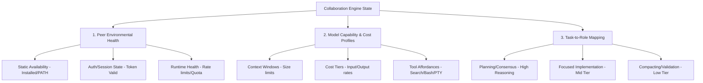

# [PLAN] MECE Peer Status Standardizing & Sub-Model Strategy

## 1. Confirmation of Direction
This plan establishes the design for peer status verification and sub-model routing, adhering to the **no-code / composable / General-Specific / JSON-config** paradigm:
*   **No-Code Declarative Checks**: Avoid writing distinct custom `.bat` scripts per peer for simple checks. Instead, status and capability validation should be driven by structured JSON checklists resolved by a general python engine.
*   **General-Specific Separation**: Universal invariants and schemas are defined at the General level (e.g., `protocol.json`), while peer-specific parameters (exec paths, model mappings, specific arguments) are provided in Specific layers (e.g., `peers.json` or `orchestration.json`).
*   **Connector Layer Mapping**: Every state check or executable action maps to a stateless, schema-validated connector intent rather than hardcoded invocation.

---

## 2. MECE Categories for Peer Status & Model Routing

To ensure a Mutually Exclusive, Collectively Exhaustive (MECE) model, we partition the system state into three primary areas:



### 2.1. Peer Environmental Health (MECE Status Matrix)
1.  **Static Availability**: Is the executable binary present in the portable directory (`_sys/tools/`) or system `PATH`? (Binary Exists vs. Binary Missing)
2.  **Authentication/Session State**: Is the credentials token or API session configured and currently valid? (Authenticated vs. Unauthenticated/Expired)
3.  **Runtime Health & Rate Status**: Is the node capable of executing immediate requests without being blocked by API rate limits, server errors, or local lockouts? (Available vs. Degraded/Rate-Limited vs. Quarantined)

### 2.2. Model Capabilities & Cost Profiles (MECE Tiers)
1.  **Context Bounds**:
    *   *Short-Context (<32K)*: Low-tier models for minor validations.
    *   *Medium-Context (32K - 128K)*: Core implementation models.
    *   *Large-Context (>128K)*: Research and large-corpus analysis models.
2.  **Cost Tiers**:
    *   *Low-Cost (Flash / Haiku)*: Used for routine checks, status updates, and compaction hooks.
    *   *Medium-Cost (Pro / Sonnet)*: Default coding, execution, and unit-testing model.
    *   *High-Cost (Ultra / Opus)*: Used for architectural revisions and resolving consensus deadlocks.
3.  **Tool Affordances**:
    *   *Read-Only / Local Sandbox*: Codebase exploration, file viewing, static checks.
    *   *Local Executor (PTY)*: Running tests, executing shell commands.
    *   *External Connector*: Performing web searches, fetching documentation.

### 2.3. Task-to-Role Mapping (MECE Roles)
1.  **Coordinator (Planning & Delegation)**: High reasoning depth; resolves consensus.
2.  **Implementer (Logic Modification)**: Strong code generation and local execution.
3.  **Verifier (Independent Verification)**: High semantic accuracy; reviews outputs and tests.
4.  **Researcher (Context Loading & External I/O)**: Large context window; handles documentation/web search.
5.  **Observer (Context-Only)**: Zero mutations; tracks room state.

---

## 3. Risks & Gaps

### 3.1. Technical Risks
*   **Stale Status / Ping Storms**: Frequently calling external CLI checking commands (`where.exe`, `status`) at the start of every message introduces high latency and token waste.
*   **Instruction Drift on Weaker Models**: Delegating handoffs or logs compaction to a low-cost model (e.g. Flash) runs the risk of model-routing protocol violations (e.g. attempting to modify workspace code without consensus).
*   **Rate-Limit Cascades**: If the coordinator elects a cheaper model (e.g., Flash) due to a primary model's rate limit, but the cheaper model gets rate-limited too, the room can fall into a loop of continuous coordinator reassignment (leader churn).
*   **Forwarding Loops**: A single-hop forwarding policy (`human_interface -> coordinator`) might be bypassed if roles are reassigned dynamically during a task, resulting in deep relay chains.

### 3.2. Portability & Sandbox Risks
*   **Host Dependency**: Checking executable availability via system shell commands (`where.exe`) can fail or return false positives depending on Windows PATH pollution.
*   **Credential Leakage**: Writing authentication statuses to shared `status.json` files must never leak actual API keys, user tokens, or host paths to git-tracked files.

---

## 4. Missing Alternatives

### 4.1. Declarative Checker Engine (No-Code Status Check)
*   **Instead of**: Building separate `.bat` scripts (`codex-status.bat`, `antigravity-status.bat`) for every peer.
*   **Proposed Alternative**: Implement a single, generic python status verification engine in `hub.py` that reads a checklist declaration from `peers.json`:
    ```json
    "codex": {
      "status_check": {
        "engine": "binary_and_file",
        "binary": "codex",
        "auth_indicator_file": "_sys/codex/config/session.json",
        "auth_command": "codex auth-check"
      }
    }
    ```
    This eliminates script drift and guarantees CP949/UTF-8 output safety.

### 4.2. Dynamic Parameterized Peer Profiles (Virtual Node Aliasing)
*   **Instead of**: Defining static separate peers (e.g., `gc-fast` vs `gc-deep` vs `cc-smart`) in `nodes.json`.
*   **Proposed Alternative**: Map logical peers to dynamic model profiles. The coordinator can request a peer to run with a specific `--effort` or `--model` override command-line argument at runtime, resolving the model dynamically at invocation time.

### 4.3. Soft Failover / Graceful Degradation
*   **Instead of**: Marking a peer as fully `RED` and blocking all routing to it.
*   **Proposed Alternative**: Introduce a `YELLOW` (Degraded) state. If a peer is degraded, it is blocked from coordinator/planning duties but can still be queried as a read-only researcher or validator using a highly constrained, token-efficient system prompt.

---

## 5. Next Steps for Consensus

1.  **Consensus Vote (R10)**: Review this design and agree on whether to implement the **Declarative Checker Engine** or fallback to the script-based approach.
2.  **MVI Task Continuity**: CX to resume role-based leader execution once the status contract is locked.
